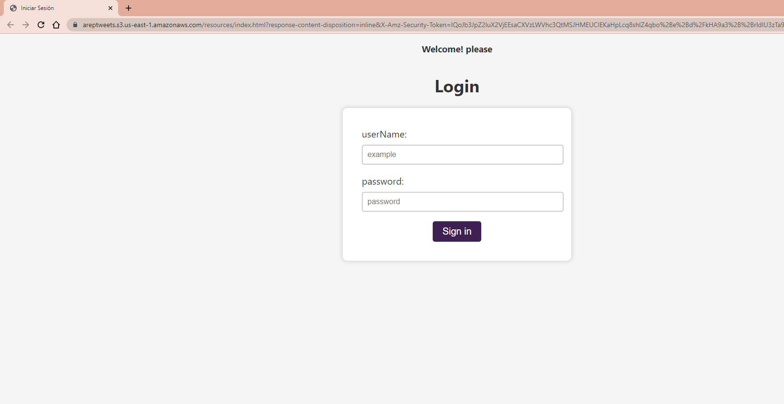
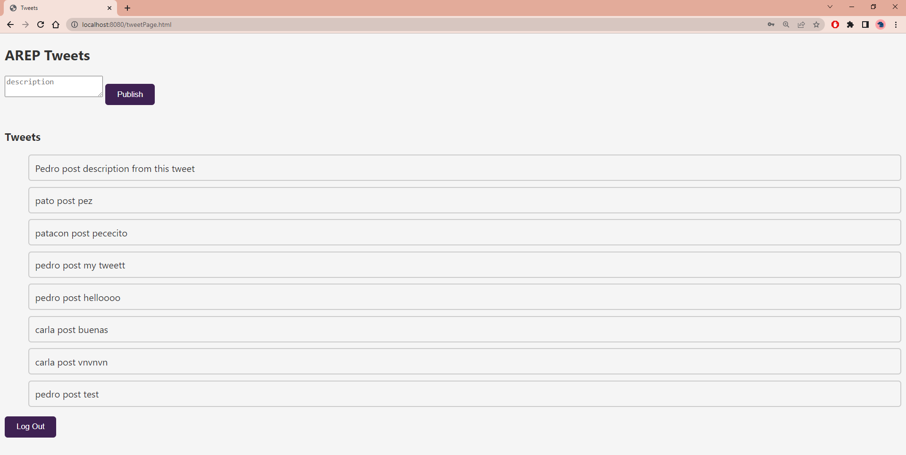
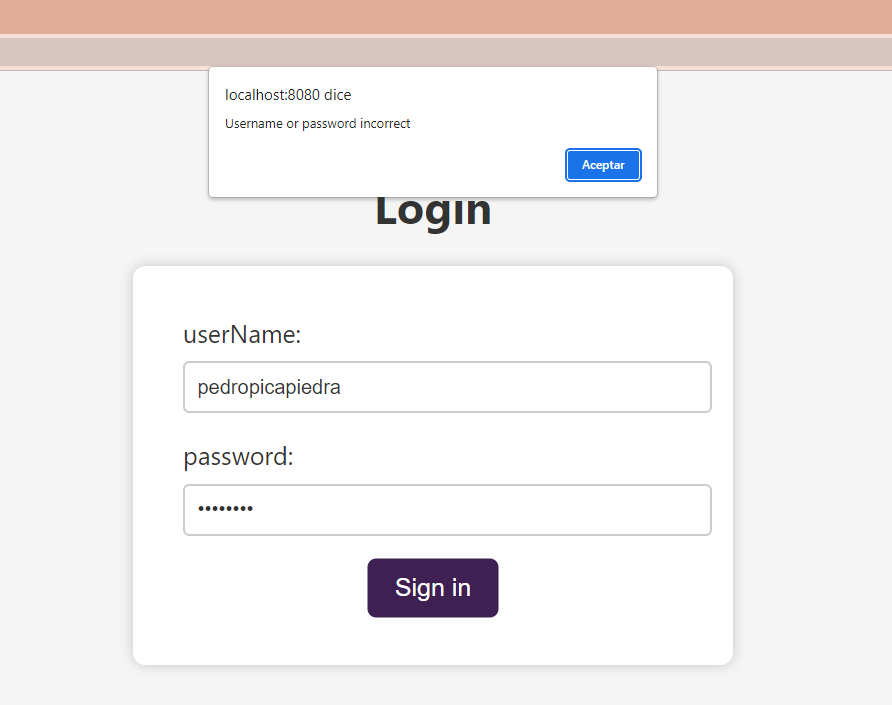
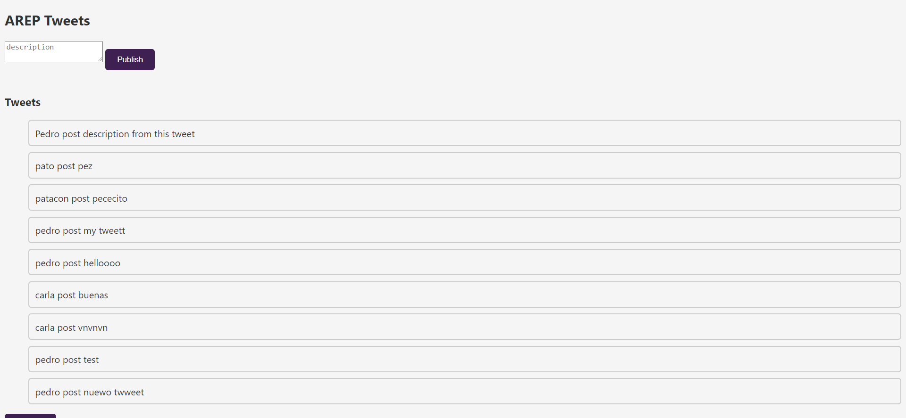

### Integrantes: Wilson Delgado y Juanita Oramas
# Taller Microservicios con Quarkus

Aplicacion para la publicacion de Tweets, con un sistema de logeo basico donde permite los Tweets desplegado en AWS y con su seguridad mediante JWT para la conexion de APIs. La base de datos utlizada es mongoDB.


# 


### Prerequisites

El proyecto se hizo con Maven, para visualizarlo se debe tener un framework que permita la instalacion y visualizacion de esta. Se debe verificar las versiones:

```
Java - Desarrollo (backend)
git - Sistema de control de versiones
maven - Administrador de dependencias
quarkus

```
---

### Instrucciones de uso

Para poder usar el proyecto lo primero que debe realizar es clonar este repositorio utilizando el siguiente comando desde la terminal del SO que esté utilizando:

```
git clone https://github.com/JuanitaOramas/AREP_Quarkus.git
```
# Arquitectura


## Solution 

### Formulario Log-in



##### Usuario valido 



##### Usuario invalido 



### App
Al ingresar a la aplicacion,  se puede ver el campo para agregar un nuevo tweet y los tweets antes publicados.
 


### Video demostrativo

https://pruebacorreoescuelaingeduco-my.sharepoint.com/:v:/g/personal/maria_oramas_mail_escuelaing_edu_co/Eb28-zWvVEpCjwxEywTTWzwB1bquD846xaFDXZ24t15eBw?e=aU6p0B


## Construido con:

-   [Intellij](http://www.dropwizard.io/1.0.2/docs/) - The web framework used
-   [Maven](https://maven.apache.org/) - Dependency Management